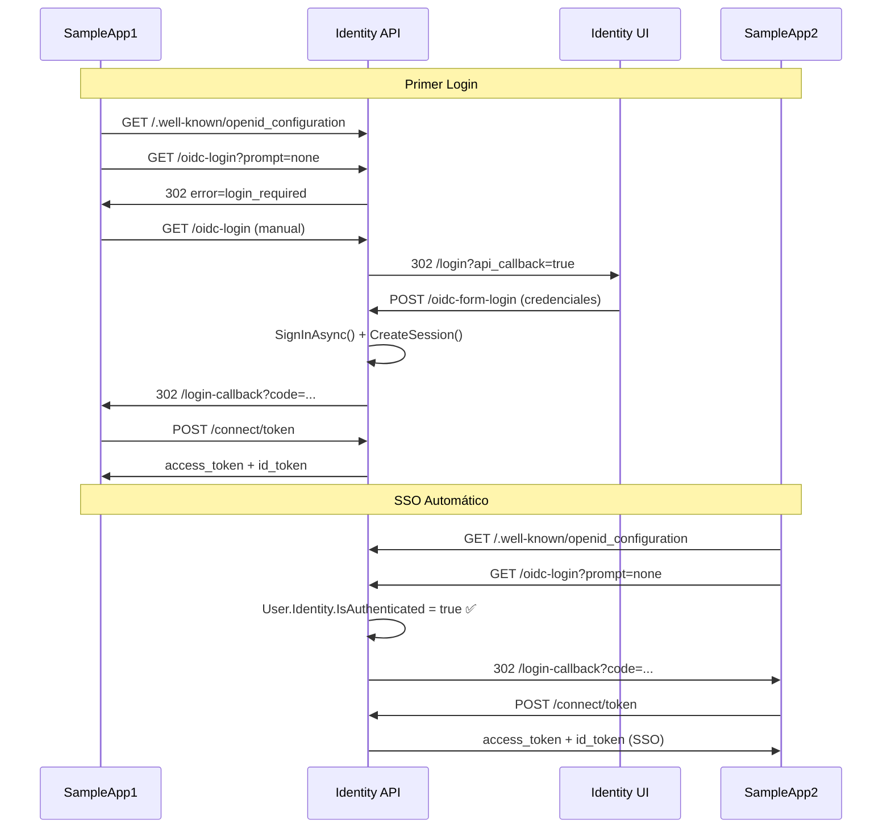

# Identity Server SSO - Documentación del Flujo

## Arquitectura General

### Componentes
- **Identity Server API** (Puerto 5000): Endpoints OIDC y puente de autenticación
- **Identity Server UI** (Puerto 7000): Interfaz de login con Blazor WebAssembly  
- **SampleApp1, SampleApp2, SampleApp3** (Puertos 7001, 7002, 7003): Aplicaciones cliente con SSO

---

## Flujo Completo de SSO

### 1. **Primer Acceso - Sin Sesión Existente**

#### **SampleApp1 - Carga Inicial**
1. **Discovery**: SampleApp1 consulta `/.well-known/openid_configuration`
   - Obtiene: `authorization_endpoint = "/api/auth/oidc-login"`
   - Obtiene: `token_endpoint = "/connect/token"`

2. **Silent Login Automático**: Paquete OIDC envía request automático
   ```
   GET /api/auth/oidc-login?prompt=none&client_id=sampleapp1&...
   ```

3. **API Verifica Autenticación**: 
   - `HttpContext.User.Identity.IsAuthenticated` = **false**
   - Como `prompt=none` → Devuelve `error=login_required`

4. **SampleApp1 Muestra Login**: Usuario ve botón "Sign In"

#### **Login Manual del Usuario**
5. **Click en Login**: Paquete OIDC redirige **sin** `prompt=none`
   ```
   GET /api/auth/oidc-login?client_id=sampleapp1&redirect_uri=...
   ```

6. **API Bridge**: Como no hay autenticación, redirige a UI
   ```
   302 → https://localhost:7000/login?api_callback=true&client_id=...
   ```

7. **UI de Login**: Usuario ingresa credenciales (admin@example.com / Admin123!)

8. **Validación y Autenticación**:
   ```
   POST /api/auth/oidc-form-login
   ```
   - Valida credenciales contra base de datos
   - Crea sesión en BD: `SessionService.CreateSessionAsync()`
   - **Crea autenticación .NET**: `HttpContext.SignInAsync()` con Claims
   - Genera código OIDC: `TokenService.GenerateAuthorizationCodeAsync()`
   - Redirige: `https://localhost:7001/authentication/login-callback?code=...`

9. **Token Exchange**: SampleApp1 intercambia código por tokens
   ```
   POST /connect/token
   ```
   - Envía: `code`, `client_id`, `code_verifier` (PKCE)
   - Recibe: `access_token`, `id_token`

10. **Usuario Autenticado**: SampleApp1 muestra contenido protegido

---

### 2. **SSO Automático - Con Sesión Existente**

#### **SampleApp2 - Primera Carga**
1. **Discovery**: Consulta `/.well-known/openid_configuration` 

2. **Silent Login**: Paquete OIDC envía automático
   ```
   GET /api/auth/oidc-login?prompt=none&client_id=sampleapp2&...
   ```

3. **API Detecta Autenticación**: 
   - `HttpContext.User.Identity.IsAuthenticated` = **true** ✅
   - Extrae `userId` de Claims
   - **Genera código directamente** sin redirigir a UI

4. **Respuesta Automática**:
   ```
   302 → https://localhost:7002/authentication/login-callback?code=...
   ```

5. **Token Exchange Automático**: SampleApp2 obtiene tokens sin intervención del usuario

6. **SSO Completado**: Usuario aparece autenticado automáticamente

---

## Detalles Técnicos

### **Claims de Autenticación .NET**
```csharp
new Claim(ClaimTypes.NameIdentifier, user.Id.ToString()),
new Claim(ClaimTypes.Email, user.Email),
new Claim(ClaimTypes.GivenName, user.FirstName),
new Claim(ClaimTypes.Surname, user.LastName),
new Claim("name", $"{user.FirstName} {user.LastName}"),
new Claim("session_id", session.SessionId)
```

### **Cookies de Sesión**
- **Autenticación .NET**: `IdentityServer.Auth` (HttpOnly, segura)
- **Sesión personalizada**: `IdentityServer.Session` (para compatibilidad)

### **PKCE (Proof Key for Code Exchange)**
- Genera `code_challenge` y `code_verifier` automáticamente
- Valida en token exchange para prevenir ataques

### **Endpoints Principales**
- `GET /.well-known/openid_configuration` - Discovery
- `GET /api/auth/oidc-login` - Bridge OIDC (con/sin prompt)
- `POST /api/auth/oidc-form-login` - Procesamiento de credenciales
- `POST /connect/token` - Intercambio código por tokens
- `GET /connect/userinfo` - Información del usuario autenticado

---

## Flujo de Datos



---

## Características Implementadas

✅ **Estándar OIDC completo**  
✅ **PKCE para seguridad**  
✅ **Silent login** con `prompt=none`  
✅ **SSO automático** entre aplicaciones  
✅ **Autenticación .NET nativa**  
✅ **Token exchange** estándar  
✅ **Discovery endpoint**  
✅ **JWT tokens** con RSA256  
✅ **Claims estándar** OIDC  
✅ **Cookie-based sessions**  

---

## Credenciales de Demo

- **Admin**: admin@example.com / Admin123!
- **User**: user@example.com / User123!

---

## URLs de Aplicaciones

- **SampleApp1**: https://localhost:7001 (punto de entrada principal)
- **SampleApp2**: https://localhost:7002 (prueba SSO)
- **SampleApp3**: https://localhost:7003 (prueba SSO)
- **Identity UI**: https://localhost:7000 (página de login)
- **Identity API**: https://localhost:5000 (endpoints OIDC)